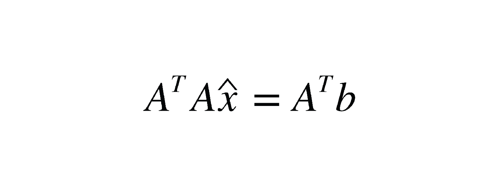

After learning, practicing, and making article about overdetermined system of linear equation, 
it is always good that i do the same in python using popular library so i know my way around thing.

So here it is
### How to Solve Overdetermined System of Linear Equation in Python using NumPy

we're gonna use Normal Equation formula to find the best-fit solution of the overdetermined system.

For more information, read my article:
[Guide on How To Find The Best-Fit Solutions in Linear Overdetermined System](https://medium.com/@MiloAillo/guide-on-how-to-find-the-best-fit-solutions-in-linear-overdetermined-system-614fb7e8dc47)
